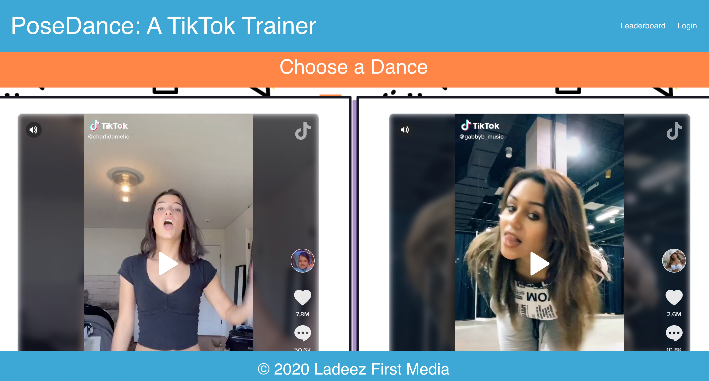

# Azure Static Web Apps Gallery Sample Projects 

A gallery of sample projects in JavaScript/Node.js and frameworks/Jamstack site generators deployed in **[Azure Static Web Apps](https://docs.microsoft.com/azure/static-web-apps?WT.mc_id=staticwebapps-github-cxa)**.

## Projects 💻

- [Angular Projects](#angular-projects)
  - [Catsify: A cat names generator](#catsify-a-cat-names-generator)
  - [xLayers: Generate Code from SketchApp](#xlayers-generate-code-from-sketchapp)
  - [Angular AppStore](#angular-appstore)
  - [ngxtools: Angular Package Registry](#ngxtools-angular-package-registry)
- [Gatsby Projects](#gatsby-projects)
  - [Gatsby Website](#gatsby-website)
  - [Gatsby Portfolio Website](#gatsby-portfolio-website)
- [Hexo Projects](#hexo-projects)
  - [Hexo Website](#hexo-website)
  - [Hexo Portfolio Website](#hexo-portfolio-website)
- [Hugo Projects](#hugo-projects)
  - [Hugo Website](#hugo-website)
  - [Hugo Portfolio Website](#hugo-portfolio-website)
- [Jekyll Projects](#jekyll-projects)
  - [Jekyll Website](#jekyll-website)
  - [Jekyll Portfolio Website](#jekyll-portfolio-website)
- [Metalsmith Projects](#metalsmith-projects)
  - [Metalsmith Website](#metalsmith-website)
  - [Metalsmith Portfolio Website](#metalsmith-portfolio-website)
- [Next.js Projects](#nestjs-projects)
  - [Next.js Todo App](#nestjs-todo-app)
  - [Next.js Weather App](#nestjs-weather-app)
- [Next.js Projects](#nestjs-projects)
  - [Next.js Todo App](#nestjs-todo-app)
  - [Next.js Weather App](#nestjs-weather-app)
- [Node.js Projects](#nodejs-projects)
  - [Node.js Todo App](#nodejs-todo-app)
  - [Node.js Weather App](#nodejs-weather-app)
- [Nuxt.js Projects](#nuxtjs-projects)
  - [Nuxt.js Todo App](#nuxtjs-todo-app)
  - [Nuxt.js Weather App](#nuxtjs-weather-app)
- [React.js Projects](#reactjs-projects)
  - [React.js Todo App](#reactjs-todo-app)
  - [React.js Weather App](#reactjs-weather-app)
- [Svelte Projects](#sveltejs-projects)
  - [Svelte Todo App](#sveltejs-todo-app)
  - [Svelte Weather App](#sveltejs-weather-app)
- [Vanilla HTML/JavaScript Projects](#html-projects)
  - [Azure SWAG Demo: A Positive Thought For Your Day](#azure-swag-demo-a-positive-thought-for-your-day)
  - [Hexa CLI Landing Page](#hexa-cli-landing-page)
  - [Nitrooo landing page](#nitrooo-landing-page)
- [Vue.js Projects](#vuejs-projects)
  - [PoseDance: A TikTok Trainer App](#poseDance-a-tiktok-trainer-app)
  - [Maya Database Archive](#maya-database
- [VuePress Projects](#vuepress-projects)
  - [Peacock for Visual Studio Code Documentation](#peacock-for-visual-studio-code-documentation)
  - [VuePress Portfolio Website](#vuepress-portfolio-website)

## Angular Projects

Here you will find a list of several Angular projects that use **[Static Web Apps](https://docs.microsoft.com/azure/static-web-apps?WT.mc_id=staticwebapps-github-cxa)**.

### **[Catsify: A cat names generator](https://www.catsify.app/)**

  

Catsify is a simple and creative app that allows you to find a unique name for your lovely cat. What's interesting about this app is that the names generator is all written in Rust and compiled to WASM; and the API is exposed through a Node.js Azure Function.

- Link to the project: **[HERE](https://www.catsify.app/)**
- GitHub repo: **[HERE](https://github.com/manekinekko/catsify)**

> Stacks Used: `angular, typescript, azure static web apps, rust, web assembly, nodejs, azure functions`

### **[xLayers: Generate Code from SketchApp](https://www.xlayers.design/)**

  
   
  

xLayers is an online Web application which aims to bridge the gap between designers and developers. Its mission is to allow both the Design and Development worlds to collaborate and iterate fast. Simply upload your design to xLayers and instantly scaffolds code for many popular frameworks1 and libraries such as Angular, Vue, React, Stencil...etc.

- Link to the project: **[HERE](https://www.xlayers.design/)**
- GitHub repo: **[HERE](https://github.com/xlayers/xlayers)**

> Stacks Used: `angular, typescript, azure static web apps`

=======

### **[Angular AppStore](https://www.searchapp.store/)**

  

Angular AppStore is a reference app featuring a full search user experience using Algolia. Users can enjoy the fast and smooth experience.

- Link to the project: **[HERE](https://www.searchapp.store/)**
- GitHub repo: **[HERE](https://github.com/manekinekko/angular-search-experience)**

> Stacks Used: `angular, typescript, azure static web apps, material design, algolia`

### **[ngxtools: Angular Package Registry](https://www.ngx.tools/)**

  

NgxTools is an NPM registry clone made only for Angular packages. You can access hundred thousand of packages built specifically for Angular and available on NPM. You can access their metadata information, and even open them directly on StackBlitz.

- Link to the project: **[HERE](https://www.ngx.tools/)**
- GitHub repo: **[HERE](https://github.com/ngxtools/ngxtools)**

> Stacks Used: `angular, typescript, azure static web apps, pwa, algolia`

---

## Gatsby Projects

Here you will find a list of several Gatsby projects that use **[Static Web Apps](https://docs.microsoft.com/azure/static-web-apps?WT.mc_id=staticwebapps-github-cxa)**.

### Gatsby Website

a little descriptions about the project.

Link to the project: **[HERE]()**

> Stacks Used: `gatsby, nodejs, azure static web apps`

### Gatsby Portfolio Website

a little descriptions about the project.

Link to the project: **[HERE]()**

> Stacks Used: `gatsby, nodejs, azure static web apps`

---

## Hexo Projects

Here you will find a list of several Hexo projects that use **[Static Web Apps](https://docs.microsoft.com/azure/static-web-apps?WT.mc_id=staticwebapps-github-cxa)**.

### Hexo Website

a little descriptions about the project.

Link to the project: **[HERE]()**

> Stacks Used: `hexo, nodejs, azure static web apps`

### Hexo Portfolio Website

a little descriptions about the project.

Link to the project: **[HERE]()**

> Stacks Used: `hexo, nodejs, azure static web apps`

---

## Hugo Projects

Here you will find a list of several Hugo projects that use **[Static Web Apps](https://docs.microsoft.com/azure/static-web-apps?WT.mc_id=staticwebapps-github-cxa)**.

### Hugo Website

a little descriptions about the project.

Link to the project: **[HERE]()**

> Stacks Used: `hugo, nodejs, azure static web apps`

### Hugo Portfolio Website

a little descriptions about the project.

Link to the project: **[HERE]()**

> Stacks Used: `hugo, nodejs, azure static web apps`

---

## Jekyll Projects

Here you will find a list of several Jekyll projects that use **[Static Web Apps](https://docs.microsoft.com/azure/static-web-apps?WT.mc_id=staticwebapps-github-cxa)**.

### Jekyll Website

a little descriptions about the project.

Link to the project: **[HERE]()**

> Stacks Used: `jekyll, ruby, azure static web apps`

### Jekyll Portfolio Website

a little descriptions about the project.

Link to the project: **[HERE]()**

> Stacks Used: `jekyll, ruby, azure static web apps`

---

## Metalsmith Projects

Here you will find a list of several Metalsmith projects that use **[Static Web Apps](https://docs.microsoft.com/azure/static-web-apps?WT.mc_id=staticwebapps-github-cxa)**.

### Metalsmith Website

a little descriptions about the project.

Link to the project: **[HERE]()**

> Stacks Used: `metalsmith, azure static web apps`

### Metalsmith Portfolio Website

a little descriptions about the project.

Link to the project: **[HERE]()**

> Stacks Used: `metalsmith, azure static web apps`

---

## Next.js Projects

Here you will find a list of several Next.js projects that use **[Static Web Apps](https://docs.microsoft.com/azure/static-web-apps?WT.mc_id=staticwebapps-github-cxa)**.

### Next.js Todo App

a little descriptions about the project.

Link to the project: **[HERE]()**

> Stacks Used: `nextjs, azure static web apps`

### Next.js Weather App

a little descriptions about the project.

Link to the project: **[HERE]()**

> Stacks Used: `nextjs, azure static web apps`

---

## Node.js Projects

Here you will find a list of several Node.js projects that use **[Static Web Apps](https://docs.microsoft.com/azure/static-web-apps?WT.mc_id=staticwebapps-github-cxa)**.

### Node.js Todo App

a little descriptions about the project.

Link to the project: **[HERE]()**

> Stacks Used: `nodejs, azure static web apps`

### Node.js Weather App

a little descriptions about the project.

Link to the project: **[HERE]()**

> Stacks Used: `nodejs, azure static web apps`

---

## Nuxt.js Projects

Here you will find a list of several Nuxt.js projects that use **[Static Web Apps](https://docs.microsoft.com/azure/static-web-apps?WT.mc_id=staticwebapps-github-cxa)**.

### Nuxt.js Todo App

a little descriptions about the project.

Link to the project: **[HERE]()**

> Stacks Used: `nuxtjs, azure static web apps`

### Nuxt.js Weather App

a little descriptions about the project.

Link to the project: **[HERE]()**

> Stacks Used: `nuxtjs, azure static web apps`

---

## React.js Projects

### [Sunrise Standup](https://www.sunrisestandup.com)

A social platform for teams to post 15 second status update videos. Videos are uploaded and streamed from Azure Storage, videos are transcribed using Cognitive Services and user locations are shown with Azure Maps.

> Stacks Used: `reactjs, azure static web apps, azure storage, azure cognitive services, azure maps`

- Link to the project: **[HERE](https://www.sunrisestandup.com)**
- GitHub repo: **[HERE](https://github.com/sunrise-standup/sunrise-standup)**

---

## Svelte Projects

Here you will find a list of several Svelte projects that use **[Static Web Apps](https://docs.microsoft.com/azure/static-web-apps?WT.mc_id=staticwebapps-github-cxa)**.

### Svelte Todo App

a little descriptions about the project.

Link to the project: **[HERE]()**

> Stacks Used: `svelte, azure static web apps`

### Svelte Weather App

a little descriptions about the project.

Link to the project: **[HERE]()**

> Stacks Used: `svelte, azure static web apps`

---

## Vanilla HTML/JavaScript Projects

Here you will find a list of several vanilla HTML/JavaScript projects that use **[Static Web Apps](https://docs.microsoft.com/azure/static-web-apps?WT.mc_id=staticwebapps-github-cxa)**.

### Azure SWAG Demo: A Positive Thought For Your Day

  

This is a simple barebone demo for [Azure SWAG](https://docs.microsoft.com/azure/static-web-apps?WT.mc_id=staticwebapps-github-yolasors) (**S**tatic **W**eb **A**pps on **G**itHub).
You can use it as a template for your own apps.

- Link to the project: **[HERE](https://aka.ms/swag-demo)**
- GitHub repo: **[HERE](https://github.com/sinedied/azure-swag/)**

> Stacks Used: `html, javascript, nodejs, azure static web apps`

### **[Nitrooo landing page](https://www.nitr.ooo/)**

  

Nitro is a heavily opinionated template for building Serverless applications with NestJS, the fastest-growing NodeJS framework in the world by github stars.

- Link to the project: **[HERE](https://www.nitr.ooo/)**
- GitHub repo: **[HERE](https://github.com/nitro-stack/website)**

> Stacks Used: `javascript, css, html`

---

### [Hexa CLI Landing Page](https://www.hexa.run)

  

Hexa is the ultimate companion for the Azure CLI. It allows you to seamlessly configure, setup and deploy to different Azure services such as Resource Groups, Storage accounts, Hosting, Azure Functions and Databases (CosmosDB and Table Storage) and more.

- Link to the project: **[HERE](https://www.hexa.run)**
- GitHub repo: **[HERE](https://github.com/manekinekko/hexa/)**

> Stacks Used: `html, javascript`

---

## Vue.js Projects

Here you will find a list of several Vue.js projects that use **[Static Web Apps](https://docs.microsoft.com/azure/static-web-apps?WT.mc_id=staticwebapps-github-cxa)**.

### **[PoseDance: A TikTok Trainer App](https://proud-moss-070616b1e.azurestaticapps.net/)**

  

Using PoseNet, a Machine-Learning library that can discern body positions, this app allows you to perfect your dance moves via your webcam. Match a TikTok dance, get a high score! Also features PlayFab and Azure Functions for the backend service.

- Link to the project: **[HERE](https://proud-moss-070616b1e.azurestaticapps.net/)**
- GitHub repo: **[HERE](https://github.com/jlooper/posedance)**

> Stacks Used: `vuejs, azure static web apps, machine learning, nodejs, javascript, azure functions`

### **[Maya Database Archive](https://brave-beach-0e06ac81e.azurestaticapps.net/)**

  

The Maya Database is an archive of Maya glyphs, their locations, and their features, for use by scholars worldwide.

- Link to the project: **[HERE](https://brave-beach-0e06ac81e.azurestaticapps.net/)**
- GitHub repo: **[HERE](https://github.com/jlooper/maya-database-archive)**

> Stacks Used: `vuejs, azure static web apps, nodejs, javascript, bulma, SASS, C#, ASP.NET Core, odata, cosmosdb`

### **[VS Code Can Do That](https://www.vscodecandothat.com)

All the best things about VS Code that nobody ever bothered to show you.

- Link to the project: **[HERE](https://www.vscodecandothat.com)**
- GitHub repo: **[HERE](https://github.com/burkeholland/vscodecandothat/)**

> Stacks Used: `vuejs, azure static web apps`

---

## VuePress Projects

Here you will find a list of several VuePress projects that use **[Static Web Apps](https://docs.microsoft.com/azure/static-web-apps?WT.mc_id=staticwebapps-github-cxa)**.

### **[Peacock for Visual Studio Code Documentation](https://www.peacockcode.dev)**

  

Subtly change the color of your Visual Studio Code workspace. Ideal when you have multiple VS Code instances, use VS Live Share, or use VS Code's Remote features, and you want to quickly identify your editor.

- [Peacock Documentation](https://www.peacockcode.dev)
- [GitHub repo for Peacock Documentation](https://github.com/johnpapa/vscode-peacock)
- [Install the Peacock Extension](https://marketplace.visualstudio.com/items?itemName=johnpapa.vscode-peacock&wt.mc_id=staticwebapps-github-jopapa)

> Stacks Used: `vuepress, azure static web apps, nodejs`

### VuePress Portfolio Website

a little descriptions about the project.

Link to the project: **[HERE]()**

> Stacks Used: `vuepress, azure static web apps`

---

# Contributing

This project welcomes contributions and suggestions. Most contributions require you to agree to a
Contributor License Agreement (CLA) declaring that you have the right to, and actually do, grant us
the rights to use your contribution. For details, visit https://cla.opensource.microsoft.com.

When you submit a pull request, a CLA bot will automatically determine whether you need to provide
a CLA and decorate the PR appropriately (e.g., status check, comment). Simply follow the instructions
provided by the bot. You will only need to do this once across all repos using our CLA.

This project has adopted the [Microsoft Open Source Code of Conduct](https://opensource.microsoft.com/codeofconduct/).
For more information see the [Code of Conduct FAQ](https://opensource.microsoft.com/codeofconduct/faq/) or
contact [opencode@microsoft.com](mailto:opencode@microsoft.com) with any additional questions or comments.
