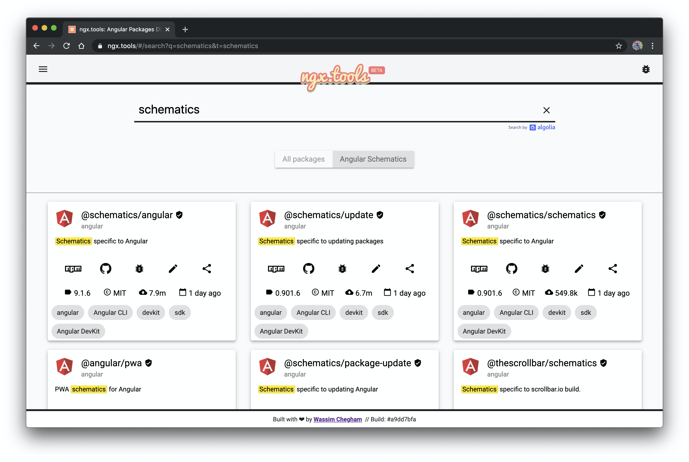
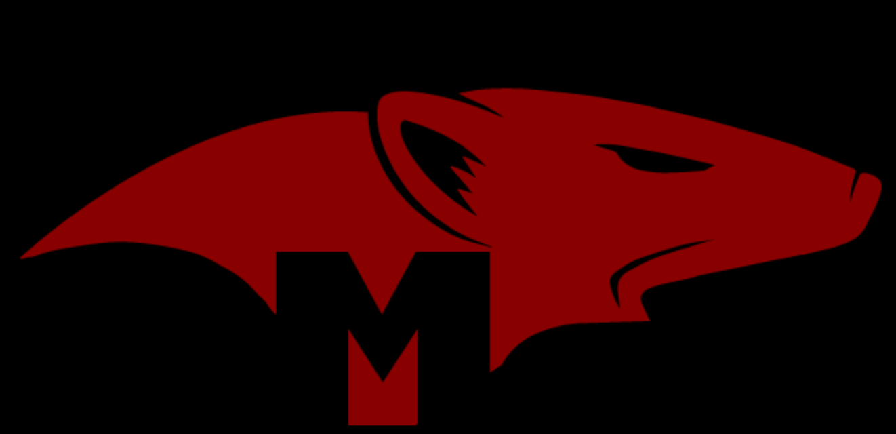
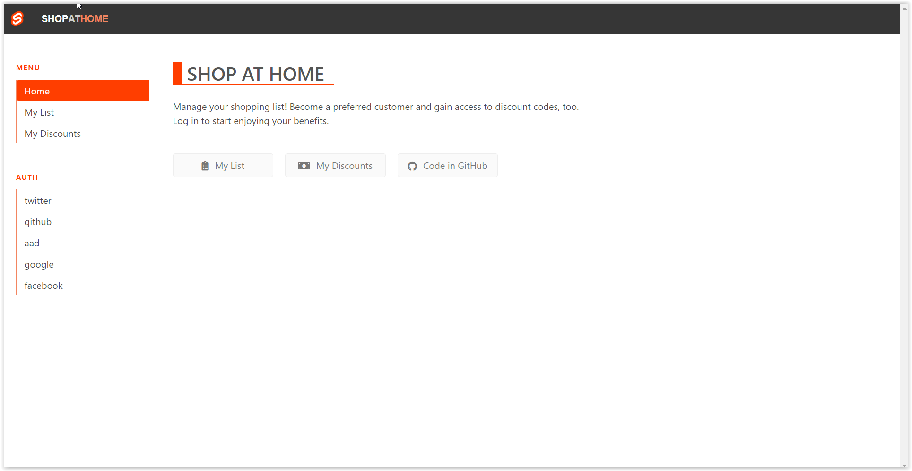
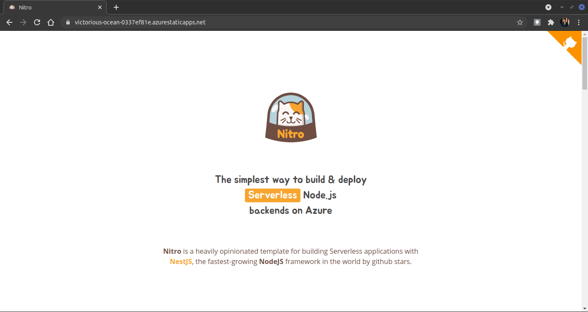

# Azure Static Web Apps Gallery 

Welcome to the Azure Static Web Apps Gallery - a showcase of awesome projects built by community, and deployed to the **[Azure Static Web Apps](https://docs.microsoft.com/azure/static-web-apps/?WT.mc_id=staticwebapps-github-cxa)** service.

---

## 🔥 | Add Your Project

Want to have your project listed in the gallery?
 * Review the [**Contributing Guidelines**](CONTRIBUTING.md).
 * Fork [**the repository**](https://github.com/nitya/static-web-apps-gallery-code-samples/fork) and create a branch for your addition
 * Follow this **[Pull Request Checklist](./.github/PULL_REQUEST_TEMPLATE/pull_request_template.md)**.

---

## 📝 | Technologies Showcased

The table showcases technologies for which projects were added - click the technology to visit the _section_ showcasing all its projects. If a project has a demo URL, the _IsLive_ column shows if that is still active (last-checked: **`Apr 18, 2022`**)

| Technology | Project | Is Live |
|:---|:---|:---|
| [`Angular`](#Angular) |  [Catsify: A cat names generator](#catsify-a-cat-names-generator)| ✅ |
| | [xLayers: Generate Code from SketchApp](#xlayers-generate-code-from-sketchapp) | 🅇 |
| | [Angular AppStore](#angular-appstore) | 🅇 |
| |  [ngxtools: Angular Package Registry](#ngxtools-angular-package-registry)|  ✅ |
| | [Meme4Fun](#meme4fun)| 🅇 |
| | [Angular Server Side Rendering](#angular-server-side-rendering)| 🅇 |
| | [Rock Paper Scissors](#rock-paper-scissors)| 🅇 |
| | [Azure Vision](#azure-vision)| 🅇 |
| | [angular-swa-auth library demo](#angular-swa-auth-library-demo)| ✅ |
| [`Docusaurus`](#docusaurus)| [Docusaurus Starter](#docusaurus-starter)| ✅ |
| [`Eleventy`](#eleventy)| [Eleventy Blog Starter](#eleventy-blog-starter)| 🅇 |
| [`Gatsby`](#gatsby)|[Gatsbyjs Starter](#gatsbyjs-starter) | 🅇 |
| [`Hugo`](#hugo) | [ngVikings 2020 Conference](#ngvikings-2020-a-free-online-conference-for-angular-developers)| ✅ |
| [`Mongoose`](#mongoose)| [SWA + Mongoose Starter Kit](#azure-static-web-apps-and-mongoose-starter-kit)| 🅇 |
| [`React`](#reactjs)| [Sunrise Standup](#sunrise-standup)| 🅇 |
| [`Stencil`](#stencil)|[Stencil Starter App](#stencil-starter-app)| 🅇 |
| [`Scully`](#scully)|  [PWA Blog](#pwa-blog)| ✅ |
| [`Svelte`](#svelte)|  [Shop at Home](#shop-at-home)|✅|
| [`Vanilla HTML/JS/CSS`](#vanilla-html-javascript-css)|[SWAG Demo: A Positive Thought For Your Day](#azure-swag-demo-a-positive-thought-for-your-day) | ✅ |
| |[Nitrooo landing page](#nitrooo-landing-page) | ✅ |
| |[Hexa CLI Landing Page](#hexa-cli-landing-page) | ✅  |
| [`Vue.js`](#vuejs)| [PoseDance: A TikTok Trainer App](#posedance-a-tiktok-trainer-app)| 🅇 |
| |[VS Code Can Do That](#vs-code-can-do-that) | ✅  |
|[`VuePress`](#vuepress) | [Nitro Workshop](#nitro-workshop)| ✅  |
| | [Peacock for Visual Studio Code Documentation](#peacock-for-visual-studio-code-documentation)| ✅  |
| |[Cognitive Search Static Apps Demo](#cognitive-search-static-apps-demo) | ✅  |

---

## 💻 | Projects (By Technology)

## Angular

### **[Catsify: A cat names generator](https://www.catsify.app/)**

  

Catsify is a simple and creative app that allows you to find a unique name for your lovely cat. What's interesting about this app is that the names generator is all written in Rust and compiled to WASM; and the API is exposed through a Node.js Azure Function.

- Link to the project: **[HERE](https://www.catsify.app/)**
- GitHub repo: **[HERE](https://github.com/manekinekko/catsify)**

> Stacks Used: `angular, typescript, azure static web apps, rust, web assembly, nodejs, azure functions`

---

### **[Angular AppStore](https://www.searchapp.store/)**

  

Angular AppStore is a reference app featuring a full search user experience using Algolia. Users can enjoy the fast and smooth experience.

- **[Angular AppStore demo](https://www.searchapp.store/)**
- **[Angular AppStore repo](https://github.com/manekinekko/angular-search-experience)**

> Stacks Used: `angular, typescript, azure static web apps, material design, algolia`

---

### **[ngxtools: Angular Package Registry](https://www.ngx.tools/)**

  

NgxTools is an NPM registry clone made only for Angular packages. You can access hundred thousand of packages built specifically for Angular and available on NPM. You can access their metadata information, and even open them directly on StackBlitz.

- **[NgxTools project](https://www.ngx.tools/)**
- **[NgxTools repo](https://github.com/ngxtools/ngx.tools)**

> Stacks Used: `angular, typescript, azure static web apps, pwa, algolia`

---

## Docusaurus

### **[Docusaurus Starter](https://ambitious-pebble-02b2d3010.azurestaticapps.net/)**

  

A simple starter template for creating documentation website using the Docusaurus framework.

> Stacks Used: `reactjs, azure static web apps`

- Link to the project: **[HERE](https://ambitious-pebble-02b2d3010.azurestaticapps.net/)**
- GitHub repo: **[HERE](https://github.com/sumitkharche/docusaurus-swa-app)**
- Author: [@sumitkharche01](https://twitter.com/sumitkharche01)

---

## Gatsby

---

## Hugo

### **[ngVikings 2020: A free online conference for Angular developers](https://www.ngvikings.org/)**

  

ngVikings is a non-profit, non-commercial, 100% community-driven event comprised of many Nordic Angular groups with more than 6500 active members in total.

- **[ngVikings site](https://www.ngvikings.org/)**
- **[ngVikings repo](https://github.com/ngvikings/ngvikings-2020)**

> Stacks Used: `hugo, azure static web apps, workbox`

---

## Mongoose

### [Azure Static Web Apps and Mongoose Starter Kit](https://github.com/GeekTrainer/aswa-student-starter-kit)

Mongoose is the most popular ODM (object document mapper) for Node.js. This basic starter includes the necessary code and steps to create Azure Static Web Apps with Cosmos DB and Mongoose. No front-end framework is used, allowing you to update the site as needed.

> Stacks Used: `mongoose, cosmos db, azure static web apps`

- **[Mongoose Starter Kit repo](https://github.com/geektrainer/aswa-student-starter-kit)
- **[Author: GeekTrainer](https://twitter.com/geektrainer)

---

## React.js

---

### **[PWA Blog](https://www.webmax.ru/)**

  

News and articles about Progressive Web Apps.

- **[Progressive web apps information](https://www.webmax.ru/)**
- **[Progressive web apps repo](https://github.com/webmaxru/webmax.ru)**

> Stacks Used: `angular, scully, azure static web apps, workbox, pwa`

---

## Svelte

### **[Shop at Home](https://www.shopathome.dev)**

  

"Shop at Home" is a sample app which is written in four variations: Angular, React, Svelte and Vue. It is shown in the Build 2020 video presentation.

- **[Shop at Home demo](https://www.shopathome.dev)**
- **[Shop at Home repo](https://github.com/johnpapa/shopathome)**

> Stacks Used: `svelte, react, angular, nodejs, azure static web apps`

---

## Vanilla HTML JavaScript CSS

### **[Azure SWAG Demo: A Positive Thought For Your Day](https://ashy-mushroom-05748f31e.azurestaticapps.net/)**

  

This is a simple barebone demo for [Azure SWAG](https://docs.microsoft.com/azure/static-web-apps?WT.mc_id=staticwebapps-github-yolasors) (**S**tatic **W**eb **A**pps on **G**itHub).
You can use it as a template for your own apps.

- **[SWAG demo](https://aka.ms/swag-demo)**
- **[SWAG repo](https://github.com/sinedied/azure-swag/)**

> Stacks Used: `html, javascript, nodejs, azure static web apps`

---

### **[Nitrooo landing page](https://victorious-ocean-0337ef81e.azurestaticapps.net/)**

  

Nitro is a heavily opinionated template for building Serverless applications with NestJS, the fastest-growing NodeJS framework in the world by github stars.

- **[Nitrooo project](https://victorious-ocean-0337ef81e.azurestaticapps.net/)**
- **[Nitrooo repo](https://github.com/nitro-stack/website)**

> Stacks Used: `javascript, css, html`

---

### **[Hexa CLI Landing Page](https://www.hexa.run)**

  

Hexa is the ultimate companion for the Azure CLI. It allows you to seamlessly configure, setup and deploy to different Azure services such as Resource Groups, Storage accounts, Hosting, Azure Functions and Databases (CosmosDB and Table Storage) and more.

- **[Hexa project](https://www.hexa.run)**
- **[Hexa repo](https://github.com/manekinekko/hexa/)**

> Stacks Used: `html, css, javascript`

---

## Vue.js

### **[VS Code Can Do That](https://www.vscodecandothat.com)**

  

All the best things about VS Code that nobody ever bothered to show you.

- **[VS Code Can Do That demo](https://www.vscodecandothat.com)**
- **[VS Code Can Do That repo](https://github.com/burkeholland/vscodecandothat/)**

> Stacks Used: `vuejs, azure static web apps`

---

## VuePress

### **[Nitro Workshop](https://nitro-stack.github.io/nitro-workshop/)**

  

Online workshop built with Vuepress to learn how to build a backend using NestJS. This is a practical workshop where you'll learn "hands-on" by iteratively building an application from scratch using NestJS and Azure.

- **[Nitro workshop](https://nitro-stack.github.io/nitro-workshop/)**
- **[Nitro workshop repo](https://github.com/nitro-stack/nitro-workshop)**

> Stacks Used: `vuepress, azure static web apps, nodejs, nestjs`

---

### **[Peacock for Visual Studio Code Documentation](https://www.peacockcode.dev)**

  

Peacock is a Visual Studio Code extension with 700,000+ installations. It subtly changes the color of your Visual Studio Code workspace. This is ideal when you have multiple VS Code instances, use VS Live Share, or use VS Code's Remote features, and you want to quickly identify your editor.

- **[Peacock Documentation](https://www.peacockcode.dev)**
- **[GitHub repo for Peacock Documentation](https://github.com/johnpapa/vscode-peacock)**
- **[Install the Peacock Extension](https://marketplace.visualstudio.com/items?itemName=johnpapa.vscode-peacock&wt.mc_id=staticwebapps-github-jopapa)**

> Stacks Used: `vuepress, azure static web apps, nodejs`

---

### [Cognitive Search Static Apps Demo](https://lively-sand-033e9ec03.azurestaticapps.net/)

  

A sample *faceted search* user experience implementation for your [Azure Cognitive Search](https://azure.microsoft.com/services/search/) index. Similar to the [official demo app](https://docs.microsoft.com/azure/search/search-create-app-portal), but a bit more modern. Fork the [repo](https://github.com/scale-tone/cognitive-search-static-web-apps-sample-ui), [deploy](https://docs.microsoft.com/azure/static-web-apps/getting-started?tabs=react#create-a-static-web-app) it to your Static Web Apps instance, connect it to your Cognitive Search index with a set of [config settings](https://github.com/scale-tone/cognitive-search-static-web-apps-sample-ui#config-settings), optionally [configure authN/authZ](https://docs.microsoft.com/azure/static-web-apps/authentication-authorization) - and you get a fully functioning search UI, with facet filters and geovisualization. The [live demo](https://lively-sand-033e9ec03.azurestaticapps.net/) is pointed to [the official Azure Cognitive Search Sample Data - Repository](https://github.com/Azure-Samples/azure-search-sample-data) index, and you can start with the same. Feel free to use as a template for your own implementations.

- **[Lively Sand demo](https://lively-sand-033e9ec03.azurestaticapps.net/)**
- **[Lively Sand repo](https://github.com/scale-tone/cognitive-search-static-web-apps-sample-ui)**
- **[Author: @tino_scale_tone](https://twitter.com/@tino_scale_tone)**

> Stacks Used: `react, nodejs, azure static web apps, azure functions`
