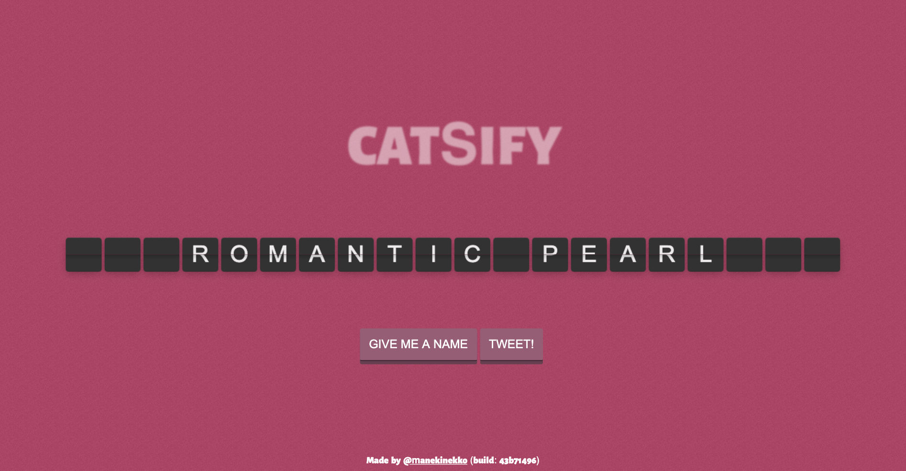
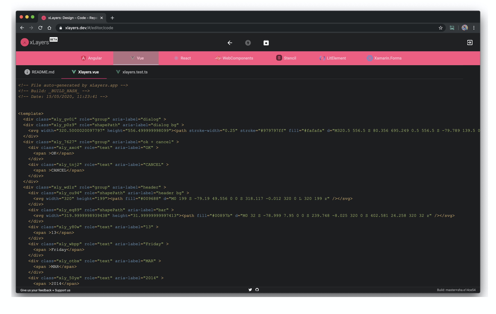
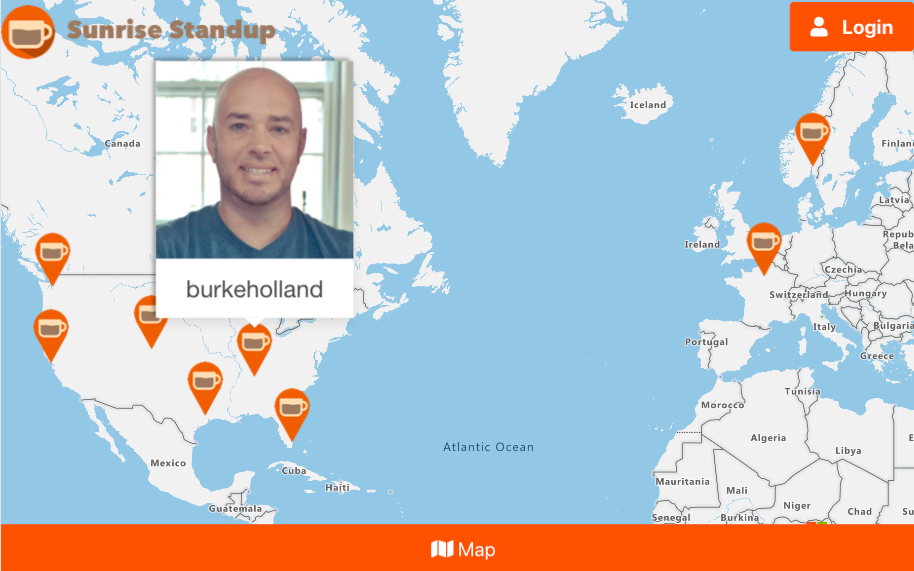
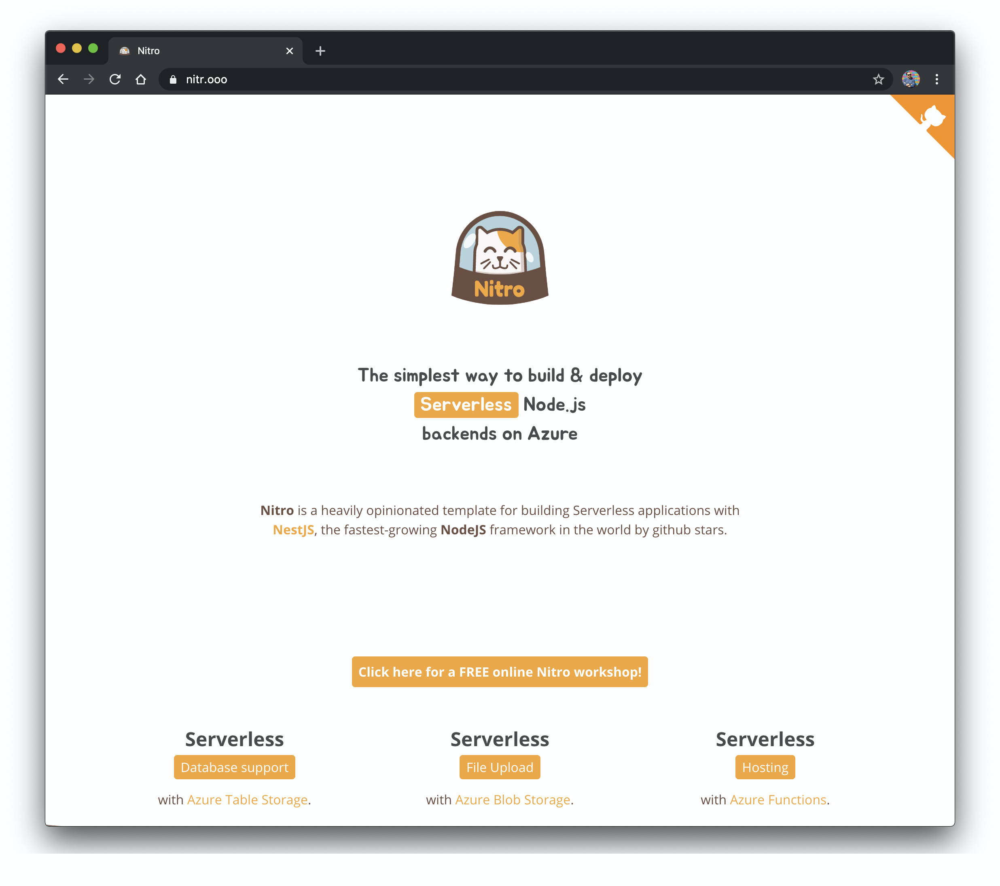
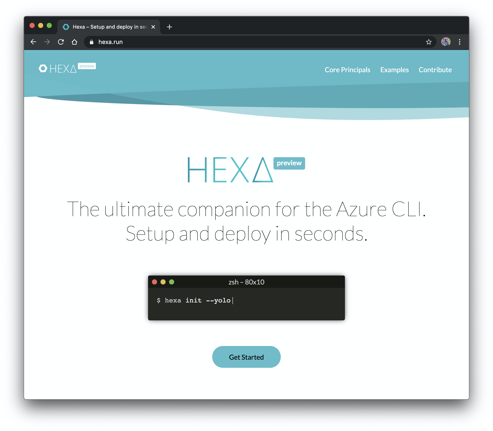
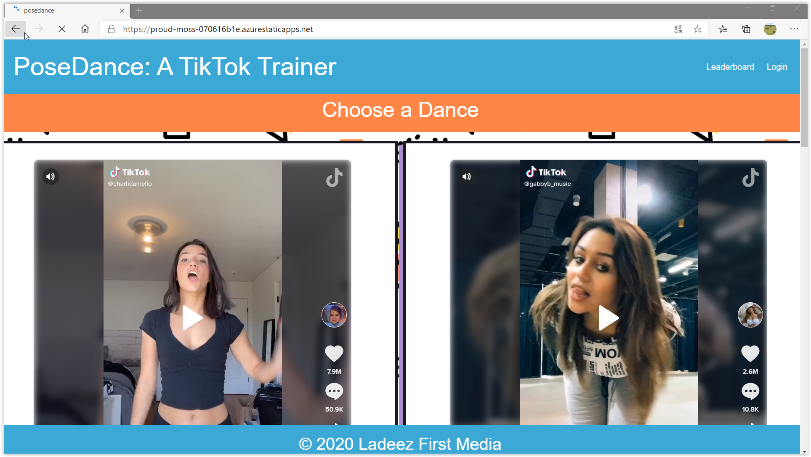

# Azure Static Web Apps Gallery Sample Projects

A gallery of sample projects in JavaScript/Node.js and frameworks/Jamstack site generators deployed in **[Azure Static Web Apps](https://docs.microsoft.com/azure/static-web-apps/?WT.mc_id=staticwebapps-github-cxa)**.

## 🔥 Submit your Projects 

Would you like to include your project hosted/deployed on **[Azure Static Web Apps](https://docs.microsoft.com/azure/static-web-apps/?WT.mc_id=staticwebapps-github-cxa)** on our gallery of samples? If so, just follow the **[Checklist for Pull Request](./.github/PULL_REQUEST_TEMPLATE/pull_request_template.md)**, which as soon as possible we will include your deployed project in our repository! 

## 💻 Projects 

- [Angular Projects](#angular-projects)
  - [Catsify: A cat names generator](#catsify-a-cat-names-generator)
  - [xLayers: Generate Code from SketchApp](#xlayers-generate-code-from-sketchapp)
  - [Angular AppStore](#angular-appstore)
  - [ngxtools: Angular Package Registry](#ngxtools-angular-package-registry)
  - [meme4fun: Angular App to generate programmer memes](#meme-4-fun)
- [Scully Projects](#scully-projects)
  - [PWA Blog](#pwa-blog)
- [Hugo Projects](#hugo-projects)
  - [ngVikings 2020: A free online conference for Angular developers](#ngvikings-2020-a-free-online-conference-for-angular-developers)
- [React.js Projects](#reactjs-projects)
  - [Sunrise Standup](#sunrise-standup)
- [Gatsby.js Projects](#gatsbyjs-projects)
  - [Simple Starter](#gatsbyjs-starter)
- [Svelte Projects](#sveltejs-projects)
  - [Svelte Todo App](#sveltejs-todo-app)
- [Vanilla HTML/JavaScript Projects](#html-projects)
  - [Azure SWAG Demo: A Positive Thought For Your Day](#azure-swag-demo-a-positive-thought-for-your-day)
  - [Hexa CLI Landing Page](#hexa-cli-landing-page)
  - [Nitrooo landing page](#nitrooo-landing-page)
- [Vue.js Projects](#vuejs-projects)
  - [PoseDance: A TikTok Trainer App](#poseDance-a-tiktok-trainer-app)
  - [VS Code Can Do That](#vs-code-can-do-that)
- [VuePress Projects](#vuepress-projects)
  - [Nitro Workshop](#nitro-workshop)
  - [Peacock for Visual Studio Code Documentation](#peacock-for-visual-studio-code-documentation)

## Angular Projects

### **[Catsify: A cat names generator](https://www.catsify.app/)**

  

Catsify is a simple and creative app that allows you to find a unique name for your lovely cat. What's interesting about this app is that the names generator is all written in Rust and compiled to WASM; and the API is exposed through a Node.js Azure Function.

- Link to the project: **[HERE](https://www.catsify.app/)**
- GitHub repo: **[HERE](https://github.com/manekinekko/catsify)**

> Stacks Used: `angular, typescript, azure static web apps, rust, web assembly, nodejs, azure functions`

### **[xLayers: Generate Code from SketchApp](https://www.xlayers.design/)**

  
   
  

xLayers is an online Web application which aims to bridge the gap between designers and developers. Its mission is to allow both the Design and Development worlds to collaborate and iterate fast. Simply upload your design to xLayers and instantly scaffolds code for many popular frameworks1 and libraries such as Angular, Vue, React, Stencil...etc.

- Link to the project: **[HERE](https://www.xlayers.design/)**
- GitHub repo: **[HERE](https://github.com/xlayers/xlayers)**

> Stacks Used: `angular, typescript, azure static web apps`

### **[Angular AppStore](https://www.searchapp.store/)**

  

Angular AppStore is a reference app featuring a full search user experience using Algolia. Users can enjoy the fast and smooth experience.

- Link to the project: **[HERE](https://www.searchapp.store/)**
- GitHub repo: **[HERE](https://github.com/manekinekko/angular-search-experience)**

> Stacks Used: `angular, typescript, azure static web apps, material design, algolia`

### **[ngxtools: Angular Package Registry](https://www.ngx.tools/)**

  

NgxTools is an NPM registry clone made only for Angular packages. You can access hundred thousand of packages built specifically for Angular and available on NPM. You can access their metadata information, and even open them directly on StackBlitz.

- Link to the project: **[HERE](https://www.ngx.tools/)**
- GitHub repo: **[HERE](https://github.com/ngxtools/ngxtools)**

> Stacks Used: `angular, typescript, azure static web apps, pwa, algolia`

### **[Meme4Fun](https://lively-forest-0fd67f010.azurestaticapps.net/)**

  

Meme4Fun is an app to create custom programming memes from a picture and it also identifies features of people in the image.

- Link to the project: **[HERE](https://lively-forest-0fd67f010.azurestaticapps.net/)**
- GitHub repo: **[HERE](https://github.com/sajeetharan/meme4fun)**

> Stacks Used: `angular, typescript, azure static web apps, material design, Azure Cognitive services`

---

## Scully Projects

### **[PWA Blog](https://www.webmax.ru/)**

  

News and articles about Progressive Web Apps.

- Link to the project: **[HERE](https://www.webmax.ru/)**
- GitHub repo: **[HERE](https://github.com/webmaxru/webmax.ru)**

> Stacks Used: `angular, scully, azure static web apps, workbox, pwa`

---

## Hugo Projects

### **[ngVikings 2020: A free online conference for Angular developers](https://www.ngvikings.org/)**

  

ngVikings is a non-profit, non-commercial, 100% community-driven event comprised of many Nordic Angular groups with more than 6500 active members in total.

- Link to the project: **[HERE](https://www.ngvikings.org/)**
- GitHub repo: **[HERE](https://github.com/ngvikings/ngvikings-2020)**

> Stacks Used: `hugo, azure static web apps, workbox`

---

## React.js Projects

### **[Sunrise Standup](https://www.sunrisestandup.com)**

A social platform for teams to post 15 second status update videos. Videos are uploaded and streamed from Azure Storage, videos are transcribed using Cognitive Services and user locations are shown with Azure Maps.

> Stacks Used: `reactjs, azure static web apps, azure storage, azure cognitive services, azure maps`

- Link to the project: **[HERE](https://www.sunrisestandup.com)**
- GitHub repo: **[HERE](https://github.com/sunrise-standup/sunrise-standup)**

---

## Gatsby.js Projects

### **[Gatsbyjs Starter](https://jolly-tree-003047c03.azurestaticapps.net/)**

A very simple starter scaffolded using the gatsby.js framework.

> Stacks Used: `reactjs, azure static web apps, gatsbyjs`

- Link to the project: **[HERE](https://jolly-tree-003047c03.azurestaticapps.net/)**
- GitHub repo: **[HERE](https://github.com/floAr/gatsby-starter-azure_swa)**

---

## Svelte Projects

### Svelte Todo App

a little descriptions about the project.

Link to the project: **[HERE]()**

> Stacks Used: `svelte, azure static web apps`

---

## Vanilla HTML/JavaScript Projects

### **[Azure SWAG Demo: A Positive Thought For Your Day](https://ashy-mushroom-05748f31e.azurestaticapps.net/)**

  

This is a simple barebone demo for [Azure SWAG](https://docs.microsoft.com/azure/static-web-apps?WT.mc_id=staticwebapps-github-yolasors) (**S**tatic **W**eb **A**pps on **G**itHub).
You can use it as a template for your own apps.

- Link to the project: **[HERE](https://aka.ms/swag-demo)**
- GitHub repo: **[HERE](https://github.com/sinedied/azure-swag/)**

> Stacks Used: `html, javascript, nodejs, azure static web apps`

### **[Nitrooo landing page](https://www.nitr.ooo/)**

  

Nitro is a heavily opinionated template for building Serverless applications with NestJS, the fastest-growing NodeJS framework in the world by github stars.

- Link to the project: **[HERE](https://www.nitr.ooo/)**
- GitHub repo: **[HERE](https://github.com/nitro-stack/website)**

> Stacks Used: `javascript, css, html`

---

### **[Hexa CLI Landing Page](https://www.hexa.run)**

  

Hexa is the ultimate companion for the Azure CLI. It allows you to seamlessly configure, setup and deploy to different Azure services such as Resource Groups, Storage accounts, Hosting, Azure Functions and Databases (CosmosDB and Table Storage) and more.

- Link to the project: **[HERE](https://www.hexa.run)**
- GitHub repo: **[HERE](https://github.com/manekinekko/hexa/)**

> Stacks Used: `html, css, javascript`

---

## Vue.js Projects

### **[PoseDance: A TikTok Trainer App](https://proud-moss-070616b1e.azurestaticapps.net/)**

  

Using PoseDance, a Machine-Learning library that can discern body positions, this app allows you to perfect your dance moves via your webcam. Match your dance, get a high score! Also features PlayFab and Azure Functions for the backend service.

- Link to the project: **[HERE](https://proud-moss-070616b1e.azurestaticapps.net/)**
- GitHub repo: **[HERE](https://github.com/jlooper/posedance)**

> Stacks Used: `vuejs, azure static web apps, machine learning, nodejs, javascript, azure functions`

### **[VS Code Can Do That](https://www.vscodecandothat.com)**

  

All the best things about VS Code that nobody ever bothered to show you.

- Link to the project: **[HERE](https://www.vscodecandothat.com)**
- GitHub repo: **[HERE](https://github.com/burkeholland/vscodecandothat/)**

> Stacks Used: `vuejs, azure static web apps`

---

## VuePress Projects

### **[Nitro Workshop](https://nitro-stack.github.io/nitro-workshop/)**

  

Online workshop built with Vuepress to learn how to build a backend using NestJS. This is a practical workshop where you'll learn "hands-on" by iteratively building an application from scratch using NestJS and Azure.

- Link to the project: **[HERE](https://nitro-stack.github.io/nitro-workshop/)**
- GitHub repo: **[HERE](https://github.com/nitro-stack/nitro-workshop)**

> Stacks Used: `vuepress, azure static web apps, nodejs, nestjs`

### **[Peacock for Visual Studio Code Documentation](https://www.peacockcode.dev)**

  

Peacock is a Visual Studio Code extension with 700,000+ installations. It subtly changes the color of your Visual Studio Code workspace. This is ideal when you have multiple VS Code instances, use VS Live Share, or use VS Code's Remote features, and you want to quickly identify your editor.

- **[Peacock Documentation](https://www.peacockcode.dev)**
- **[**GitHub repo for Peacock Documentation](https://github.com/johnpapa/vscode-peacock)**
- **[Install the Peacock Extension](https://marketplace.visualstudio.com/items?itemName=johnpapa.vscode-peacock&wt.mc_id=staticwebapps-github-jopapa)**

> Stacks Used: `vuepress, azure static web apps, nodejs`

---
